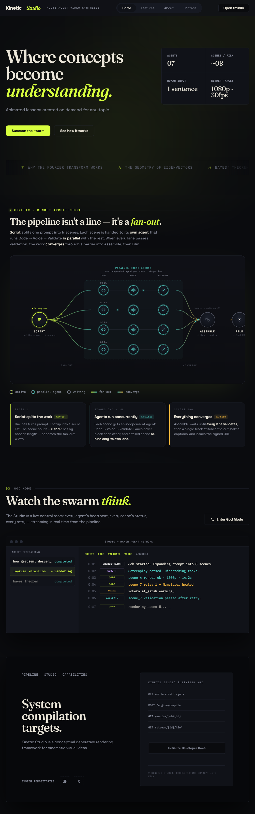
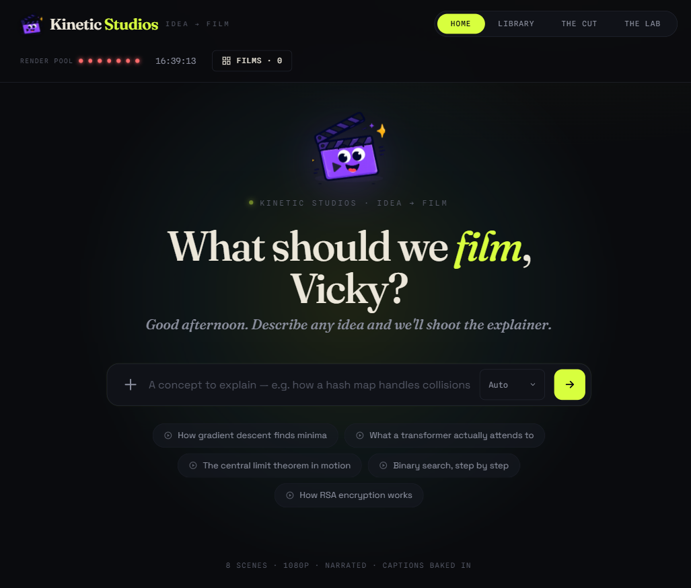
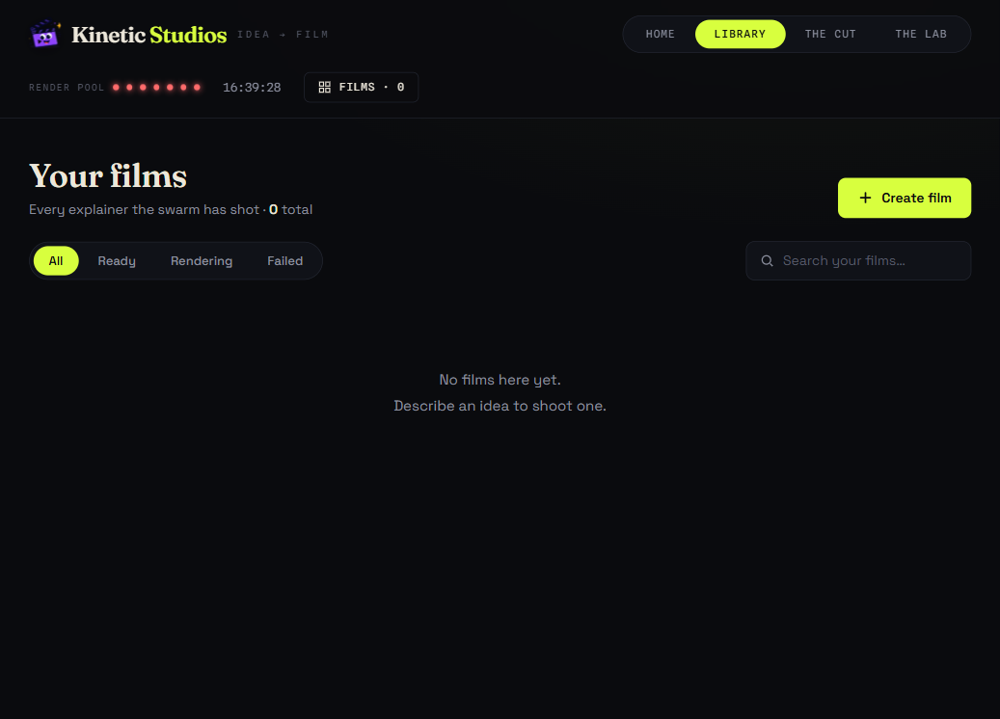
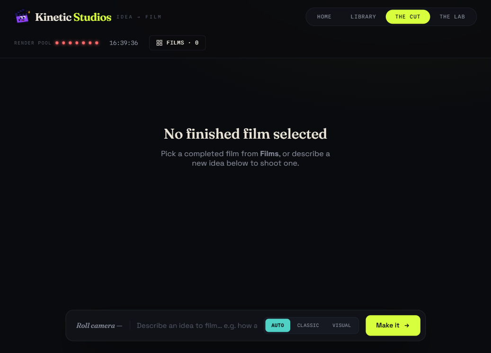
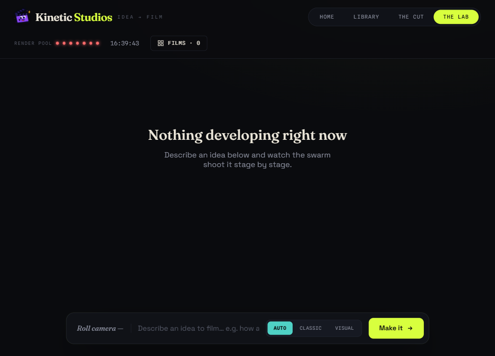
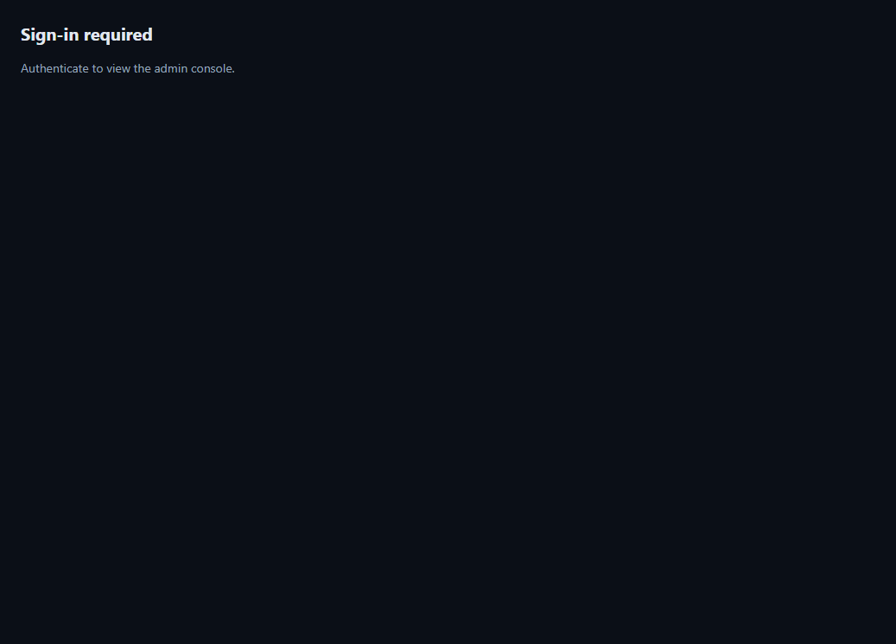

# video-gen
code to vid

## Workflow

### 1. Landing Page — Start a Video

Entry point. Describe your concept, pick a style, launch generation.

---

### 2. Studio — Home (Compose)

Describe an idea, pick render engine (Auto / Classic / Visual), hit roll.

---

### 3. Studio — Library

All your films. Filter by Ready / Rendering / Failed. Click to open in The Cut or The Lab.

---

### 4. Studio — The Cut (Finished Film)

Projection screen + scene filmstrip. Watch the finished video, scrub scene by scene, ask questions about any section.

---

### 5. Studio — The Lab (In Progress)

Live pipeline view while a job renders. Developing track shows each scene moving through Story → Create → Render → Voice → Finish.

---

### 6. Admin — Manage Jobs & Config

Job queue, service health, pipeline config, and output management.
