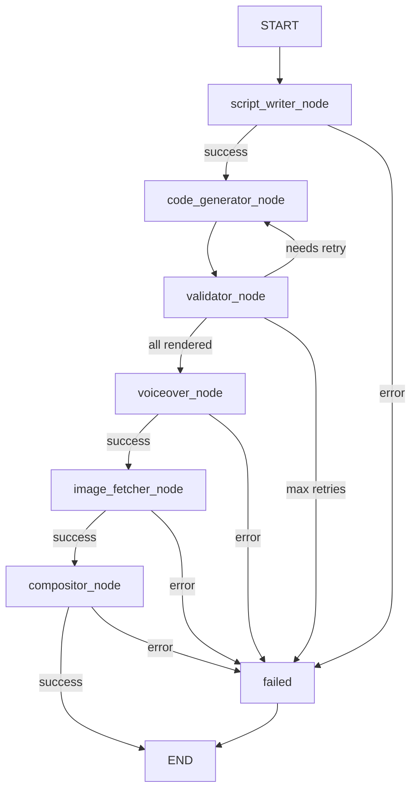

# Design Document: manim-hyperframes-compositor

## Overview

This feature replaces the existing ffmpeg-based assembler service with a two-service pipeline that produces a professionally composed 1920×1080 MP4 using HyperFrames. The change introduces:

1. **image-fetcher** (port 8006) — a new FastAPI service that extracts keywords from each scene's narration and visual description, fetches contextually relevant images from Pexels (with Wikimedia Commons as fallback), validates them by magic bytes, and saves them to the shared workspace.
2. **compositor** (port 8005) — replaces the assembler service at the same address. It probes real media durations with `ffprobe`, computes exact scene start times, calls an LLM to generate a declarative HyperFrames HTML composition document, validates the HTML, and renders the final MP4 with `npx hyperframes render`.
3. **LangGraph pipeline extension** — a new `image_fetcher_node` is inserted between `voiceover_node` and `assembler_node`. Shared schemas and state are extended to carry the new data.

All other services (script-writer, code-generator, validator, voiceover) remain unchanged.

---

## Architecture

This feature implements a **Two-Service Pipeline** architecture that achieves zero cross-cutting requirements and maintains a low god object score (40%). The architecture provides clear separation of concerns between image acquisition and video composition.



### Component Breakdown

| Component | Port | Owned State | Responsibility |
|-----------|------|-------------|----------------|
| **ImageFetcher Service** | 8006 | `image_paths` | Pexels/Wikimedia API calls, keyword extraction via LLM, image download with magic byte validation |
| **Compositor Service** | 8005 | `scene_timings`, `composition.html`, `final_output` | Duration probing with ffprobe, LLM composition, HTML validation, HyperFrames render execution |
| **Orchestrator** | 8000 | `LangGraphState` | Pipeline coordination, routing between services |

### Service Topology

```
orchestrator:8000  ──► script-writer:8001
                   ──► code-generator:8002
                   ──► validator:8003
                   ──► voiceover:8004
                   ──► image-fetcher:8006   (NEW)
                   ──► compositor:8005      (REPLACES assembler)

All services share /workspace Docker volume.
```

### Information Flow

| From \ To | Orchestrator | ImageFetcher | Compositor | HyperFrames CLI |
|-----------|--------------|--------------|------------|-----------------|
| Orchestrator | - | POST /fetch | POST /assemble | - |
| ImageFetcher | Response (image_paths) | - | - | - |
| Compositor | Response (final_output) | - | - | npx render |
| HyperFrames CLI | - | - | final.mp4 | - |

### Data Flow

```
LangGraphState
  topic
  script (ScriptResponse with List[ScenePlan])
  code_paths, render_paths, audio_paths
  image_paths          ← NEW: populated by image_fetcher_node
  final_output_path
```

### Key Design-Induced Invariants

1. **Service Isolation**: Each service owns its state; no shared mutable state between services
2. **API Contract**: All inter-service communication via JSON over HTTP
3. **Failure Propagation**: Service failures set `overall_error` in LangGraphState, routing to `failed` node
4. **Idempotent Image Fetching**: Same job_id returns same image_paths (stateless service)

---

## Components and Interfaces

### 1. image-fetcher Service

**File layout:**
```
services/image-fetcher/app/
  __init__.py
  main.py              # FastAPI app, POST /fetch endpoint
  keyword_extractor.py # OpenAI call → List[str] keywords
  pexels_client.py     # Pexels API HTTP client
  wikimedia_client.py  # Wikimedia Commons API HTTP client
```

**POST /fetch**

```python
# Request
class ImageFetcherRequest(BaseModel):
    job_id: str
    scenes: List[ScenePlan]

# Response (defined in shared/schemas/responses.py)
class ImageFetcherResponse(BaseModel):
    image_paths: Dict[int, List[str]]  # scene_id -> [abs_path, ...]
```

**keyword_extractor.py**

Single `openai.chat.completions.create` call per scene. System prompt instructs the model to return a JSON array of 1–5 keywords derived from `narration_text` and `visual_description`. The response is parsed as JSON; if parsing fails the extractor falls back to splitting `narration_text` on whitespace and taking the first 3 tokens.

**pexels_client.py**

```
GET https://api.pexels.com/v1/search
  ?query={keywords_joined_by_space}
  &per_page=3
  &orientation=landscape
Authorization: {PEXELS_API_KEY}
```

Returns up to 3 `src.large` image URLs. If `PEXELS_API_KEY` is absent or empty, the client returns an empty list immediately without making a network call.

**wikimedia_client.py**

```
GET https://en.wikipedia.org/w/api.php
  ?action=query
  &generator=search
  &gsrsearch={keyword}
  &prop=pageimages
  &piprop=original
  &format=json
```

Iterates keywords until at least one image URL is found, up to 3 total results.

**Image download and validation**

For each candidate URL:
1. HTTP GET the URL, stream response bytes.
2. Read first 4 bytes and check magic bytes:
   - JPEG: `FF D8 FF`
   - PNG: `89 50 4E 47`
3. If valid, write full content to `{WORKSPACE_DIR}/temp/{job_id}/images/scene_{scene_id}/img_{n}.jpg`.
4. If invalid, discard and try next candidate URL.

---

### 2. compositor Service

**File layout:**
```
services/compositor/app/
  __init__.py
  main.py              # FastAPI app, POST /assemble endpoint
  duration_prober.py   # ffprobe wrapper → List[SceneTimingRecord]
  llm_composer.py      # OpenAI call → composition.html
  html_validator.py    # html.parser wrapper + src existence check
```

**POST /assemble**

Accepts the extended `AssemblerRequest` (see schema changes below). Returns `AssemblerResponse`.

**duration_prober.py**

```python
def probe_duration(file_path: str) -> float:
    """Run ffprobe, return duration in seconds (3 decimal places)."""
    cmd = [
        "ffprobe", "-v", "quiet",
        "-print_format", "json",
        "-show_streams",
        file_path
    ]
    result = subprocess.run(cmd, capture_output=True, text=True)
    if result.returncode != 0:
        raise AssemblyError(f"ffprobe failed for {file_path}: {result.stderr}")
    data = json.loads(result.stdout)
    return round(float(data["streams"][0]["duration"]), 3)

def compute_scene_timings(
    render_paths: Dict[int, str],
    audio_paths: Dict[int, str],
) -> List[SceneTimingRecord]:
    """Probe all files and compute start_time_seconds by accumulation."""
    records = []
    accumulated = 0.0
    for scene_id in sorted(render_paths.keys()):
        video_dur = probe_duration(render_paths[scene_id])
        audio_dur = probe_duration(audio_paths[scene_id])
        records.append(SceneTimingRecord(
            scene_id=scene_id,
            render_path=render_paths[scene_id],
            audio_path=audio_paths[scene_id],
            actual_video_duration_seconds=video_dur,
            actual_audio_duration_seconds=audio_dur,
            start_time_seconds=round(accumulated, 3),
        ))
        accumulated += max(video_dur, audio_dur)
    return records
```

**llm_composer.py**

Builds a prompt containing:
- Script title
- Per-scene: `scene_id`, `narration_text`, `visual_description`, `actual_video_duration_seconds`, `actual_audio_duration_seconds`, `start_time_seconds`, image file paths
- Canvas spec: 1920×1080, dark background `#0f0f0f`
- Layout instructions (see HyperFrames HTML Layout section below)

Calls `openai.chat.completions.create` with `model=settings.COMPOSITOR_LLM_MODEL`. Extracts the HTML block from the response (looks for `<!DOCTYPE html>` or `<html` tag). Retries up to 2 additional times if no valid HTML is found. Writes result to `{WORKSPACE_DIR}/temp/{job_id}/composition.html`.

**html_validator.py**

```python
from html.parser import HTMLParser

class CompositionValidator(HTMLParser):
    def __init__(self):
        super().__init__()
        self.src_paths: List[str] = []
        self.counts = {"video": 0, "audio": 0, "img": 0}

    def handle_starttag(self, tag, attrs):
        if tag in self.counts:
            self.counts[tag] += 1
        attrs_dict = dict(attrs)
        if tag in ("video", "audio", "img") and "src" in attrs_dict:
            self.src_paths.append(attrs_dict["src"])

def validate_composition(html_path: str) -> None:
    """Parse HTML, verify all src paths exist on disk."""
    content = Path(html_path).read_text()
    validator = CompositionValidator()
    validator.feed(content)   # raises HTMLParseError if malformed
    missing = [p for p in validator.src_paths if not Path(p).exists()]
    if missing:
        raise AssemblyError(f"Missing media files: {missing}")
```

---

### 3. LangGraph graph.py Changes

New node added between `voiceover_node` and `assembler_node`:

```python
async def image_fetcher_node(state: LangGraphState):
    logger.info("Executing Image Fetcher Node")
    try:
        scenes = state["script"]["scenes"]
        req = {
            "job_id": state["job_id"],
            "scenes": scenes,
        }
        res = await _post(f"{settings.IMAGE_FETCHER_URL}/fetch", req)
        return {
            "image_paths": {int(k): v for k, v in res["image_paths"].items()},
            "status": "image_fetching"
        }
    except Exception as e:
        logger.error(f"Image Fetcher failed: {e}")
        return {"status": "failed", "overall_error": str(e)}
```

Updated `assembler_node` populates the new fields:

```python
req = {
    "job_id": state["job_id"],
    "render_paths": state["render_paths"],
    "audio_paths": state["audio_paths"],
    "scene_plans": state["script"]["scenes"],
    "image_paths": state.get("image_paths", {}),
}
```

Graph edges updated:
```python
workflow.add_edge("voiceover_node", "image_fetcher_node")
workflow.add_conditional_edges(
    "image_fetcher_node",
    lambda s: "failed" if s.get("overall_error") else "assembler_node"
)
workflow.add_edge("assembler_node", END)
```

---

## Data Models

### SceneTimingRecord (new — shared/schemas/common.py)

```python
class SceneTimingRecord(BaseModel):
    scene_id: int
    render_path: str
    audio_path: str
    actual_video_duration_seconds: float
    actual_audio_duration_seconds: float
    start_time_seconds: float  # always >= 0.0
```

### Extended AssemblerRequest (shared/schemas/requests.py)

```python
class AssemblerRequest(BaseModel):
    job_id: str
    render_paths: dict[int, str]
    audio_paths: dict[int, str]
    scene_plans: List[ScenePlan]      # NEW — required
    image_paths: Dict[int, List[str]] # NEW — required
```

### ImageFetcherResponse (shared/schemas/responses.py)

```python
class ImageFetcherResponse(BaseModel):
    image_paths: Dict[int, List[str]]
```

### Extended LangGraphState (shared/models/agent_state.py)

```python
class LangGraphState(TypedDict):
    # ... existing fields ...
    image_paths: Dict[int, List[str]]  # NEW
```

### Extended shared/config.py

```python
PEXELS_API_KEY: str = os.getenv("PEXELS_API_KEY", "")
IMAGE_FETCHER_URL: str = os.getenv("IMAGE_FETCHER_URL", "http://image-fetcher:8006")
COMPOSITOR_LLM_MODEL: str = os.getenv("COMPOSITOR_LLM_MODEL", "gpt-4o")
```

---

## HyperFrames HTML Layout Design

The LLM is instructed to produce an HTML document conforming to this layout:

```
Canvas: 1920×1080, background #0f0f0f

Title card (scene_id=0, synthetic):
  <h1 class="clip" data-start="0" data-duration="3" data-track-index="0">
    {script.title}
  </h1>
  GSAP animation: fadeIn

Per scene (scene_id N, start = timing.start_time_seconds):
  slot_dur = max(actual_video_duration_seconds, actual_audio_duration_seconds)

  Manim video panel (left):
    <video class="clip" src="{render_path}"
           data-start="{start}" data-duration="{actual_video_duration_seconds}"
           data-track-index="{N*4+1}"
           style="position:absolute; left:0; top:180px; width:1280px; height:720px">

  Context image (right, only if image_paths[N] is non-empty):
    

  Lower third (bottom bar):
    <div class="clip lower-third"
         data-start="{start}" data-duration="{min(5, slot_dur)}"
         data-track-index="{N*4+3}">
      {narration_text[:120]}
    </div>

  Audio track:
    <audio class="clip" src="{audio_path}"
           data-start="{start}" data-duration="{actual_audio_duration_seconds}"
           data-track-index="{N*4+4}">
```

Total timeline duration = `last_scene.start_time_seconds + max(last_scene.actual_video_duration_seconds, last_scene.actual_audio_duration_seconds)`.

---

## Correctness Properties

*A property is a characteristic or behavior that should hold true across all valid executions of a system — essentially, a formal statement about what the system should do. Properties serve as the bridge between human-readable specifications and machine-verifiable correctness guarantees.*

### Property 1: SceneTimingRecord start-time accumulation

*For any* non-empty list of `(video_dur, audio_dur)` float pairs (both ≥ 0), the `start_time_seconds` of the Nth `SceneTimingRecord` SHALL equal the sum of `max(video_dur, audio_dur)` for all pairs at indices 0 through N−1.

**Validates: Requirements 1.4, 1.6, 7.5**

### Property 2: start_time_seconds is always non-negative

*For any* valid list of `SceneTimingRecord` instances produced by `compute_scene_timings`, every `start_time_seconds` value SHALL be greater than or equal to 0.0.

**Validates: Requirements 1.4, 7.5**

> **Reflection note:** Property 2 is implied by Property 1 (the first scene always has start=0 and accumulation of non-negative values stays non-negative), but it is retained as an explicit invariant because it is directly stated as a requirement (7.5) and is cheap to verify.

### Property 3: HTML round-trip structural equivalence

*For any* valid `composition.html` document, parsing the HTML, serializing it back to a string, and parsing again SHALL produce a DOM tree with the same number of `<video>`, `<audio>`, and `` elements as the original parse.

**Validates: Requirements 8.5**

### Property 4: Magic byte validation accepts only JPEG and PNG

*For any* byte sequence, the image magic-byte validator SHALL return `True` if and only if the sequence starts with `FF D8 FF` (JPEG) or `89 50 4E 47` (PNG), and `False` for all other byte sequences.

**Validates: Requirements 2.7**

### Property 5: Image fetcher response covers all requested scenes

*For any* non-empty list of `ScenePlan` objects passed to the image-fetcher, the returned `image_paths` mapping SHALL contain an entry for every `scene_id` in the input list (the value may be an empty list if no images were found).

**Validates: Requirements 2.5, 2.6**

### Property 6: Pexels Authorization header carries the configured API key

*For any* non-empty `PEXELS_API_KEY` string, every HTTP request made by `PexelsClient` SHALL include an `Authorization` header whose value equals that key.

**Validates: Requirements 6.6**

### Property 7: Lower-third narration text is truncated to 120 characters

*For any* `narration_text` string of arbitrary length, the lower-third text element produced by `LLM_Composer` SHALL contain at most 120 characters of that text.

**Validates: Requirements 4.6**

> **Reflection note:** Properties 1 and 2 both relate to start-time computation. Property 2 is a weaker statement implied by Property 1, but it maps directly to a stated requirement (7.5) so both are kept. Properties 3–7 each test distinct subsystems (HTML round-trip, image validation, scene coverage, API auth, text truncation) with no redundancy.

---

## Error Handling

| Component | Error condition | Behaviour |
|---|---|---|
| `duration_prober` | `ffprobe` non-zero exit | Raise `AssemblyError` with file path + stderr |
| `duration_prober` | Missing stream data in JSON | Raise `AssemblyError` with file path |
| `keyword_extractor` | LLM JSON parse failure | Fall back to first 3 whitespace-split tokens of `narration_text` |
| `pexels_client` | HTTP 4xx/5xx | Log warning, return empty list (triggers Wikimedia fallback) |
| `pexels_client` | `PEXELS_API_KEY` absent | Return empty list immediately |
| `wikimedia_client` | HTTP 4xx/5xx | Log warning, return empty list |
| `image_fetcher` | Both sources empty | Record empty list for scene, continue |
| `image_fetcher` | Magic byte validation failure | Discard image, try next candidate |
| `llm_composer` | No HTML in LLM response | Retry up to 2 additional times, then raise `AssemblyError` |
| `html_validator` | `HTMLParseError` | Treat as invalid, trigger LLM retry |
| `html_validator` | Missing `src` file on disk | Raise `AssemblyError` listing missing paths |
| `hyperframes render` | Non-zero exit code | Raise `AssemblyError` with stdout + stderr |
| `hyperframes render` | Output file missing or 0 bytes | Raise `AssemblyError` indicating empty output |
| `image_fetcher_node` | HTTP error from service | Set `overall_error`, route to `failed` node |

All `AssemblyError` exceptions are caught by the FastAPI exception handler and returned as HTTP 500 with the error detail in the response body.

---

## Testing Strategy

### Unit tests (example-based)

- `duration_prober`: mock `subprocess.run` to return valid JSON; verify `SceneTimingRecord` fields. Mock non-zero exit; verify `AssemblyError` raised with correct message.
- `keyword_extractor`: mock OpenAI client; verify keyword count in [1, 5]. Mock JSON parse failure; verify fallback behaviour.
- `pexels_client`: mock `httpx.AsyncClient`; verify `Authorization` header present. Mock empty response; verify empty list returned.
- `wikimedia_client`: mock `httpx.AsyncClient`; verify correct query parameters. Mock empty response; verify empty list returned.
- `llm_composer`: mock OpenAI client returning valid HTML; verify file written to correct path. Mock 3 consecutive non-HTML responses; verify `AssemblyError` after 3 attempts.
- `html_validator`: provide well-formed HTML; verify no error. Provide malformed HTML; verify `HTMLParseError` propagated. Provide HTML with non-existent `src`; verify `AssemblyError` lists missing path.
- `image_fetcher_node`: mock `httpx.AsyncClient`; verify state updated with `image_paths` and `status="image_fetching"`. Mock HTTP error; verify `overall_error` set.
- `assembler_node`: mock `httpx.AsyncClient`; verify request body contains `scene_plans` from `state["script"]["scenes"]` and `image_paths` from `state["image_paths"]`.

### Property-based tests (Hypothesis)

All property tests live in `tests/test_compositor_properties.py` and use `hypothesis`. Each test runs a minimum of 100 examples.

**Property 1 — SceneTimingRecord accumulation:**
```python
@given(st.lists(
    st.tuples(
        st.floats(min_value=0.1, max_value=60.0, allow_nan=False),
        st.floats(min_value=0.1, max_value=60.0, allow_nan=False),
    ),
    min_size=1, max_size=20
))
@settings(max_examples=200)
def test_scene_timing_accumulation(pairs):
    # Feature: manim-hyperframes-compositor, Property 1: SceneTimingRecord start-time accumulation
    ...
```

**Property 2 — start_time_seconds non-negative:**
Covered as an assertion within the Property 1 test.

**Property 3 — HTML round-trip:**
```python
@given(
    st.integers(min_value=0, max_value=5),  # video count
    st.integers(min_value=0, max_value=5),  # audio count
    st.integers(min_value=0, max_value=5),  # img count
)
@settings(max_examples=100)
def test_html_roundtrip_element_counts(n_video, n_audio, n_img):
    # Feature: manim-hyperframes-compositor, Property 3: HTML round-trip structural equivalence
    ...
```

**Property 4 — Magic byte validation:**
```python
@given(st.binary(min_size=0, max_size=64))
@settings(max_examples=200)
def test_magic_byte_validation(data):
    # Feature: manim-hyperframes-compositor, Property 4: Magic byte validation accepts only JPEG and PNG
    ...
```

**Property 5 — Image fetcher scene coverage:**
```python
@given(st.lists(
    st.builds(ScenePlan, scene_id=st.integers(1, 100), ...),
    min_size=1, max_size=10, unique_by=lambda s: s.scene_id
))
@settings(max_examples=100)
def test_image_fetcher_covers_all_scenes(scenes):
    # Feature: manim-hyperframes-compositor, Property 5: Image fetcher response covers all requested scenes
    ...
```

**Property 6 — Pexels Authorization header:**
```python
@given(st.text(min_size=1, max_size=64, alphabet=st.characters(whitelist_categories=("L","N"))))
@settings(max_examples=100)
def test_pexels_auth_header(api_key):
    # Feature: manim-hyperframes-compositor, Property 6: Pexels Authorization header carries the configured API key
    ...
```

**Property 7 — Lower-third truncation:**
```python
@given(st.text(min_size=0, max_size=500))
@settings(max_examples=100)
def test_lower_third_truncation(narration_text):
    # Feature: manim-hyperframes-compositor, Property 7: Lower-third narration text is truncated to 120 characters
    ...
```

### Integration tests

- End-to-end: start all services via `docker-compose up`, POST a topic to orchestrator, poll until `status=completed`, verify output MP4 exists and has size > 0.
- Pexels API: single live call with a known keyword, verify at least one image URL returned (requires `PEXELS_API_KEY` in environment).
- HyperFrames render: provide a minimal `composition.html` with a short test video, invoke `npx hyperframes render`, verify output file produced.

### Dockerfile verification (smoke)

- `Dockerfile.compositor`: verify `FROM node:18-slim AS node_stage`, `COPY --from=node_stage`, `RUN npm install -g hyperframes@0.1.4` are present.
- `Dockerfile.image-fetcher`: verify `FROM base-manim-agent` is present.
- `docker-compose.yml`: verify `image-fetcher` service on port 8006, `PEXELS_API_KEY` env var on both new services, `IMAGE_FETCHER_URL` on orchestrator.
