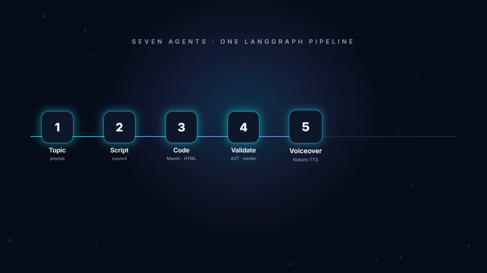
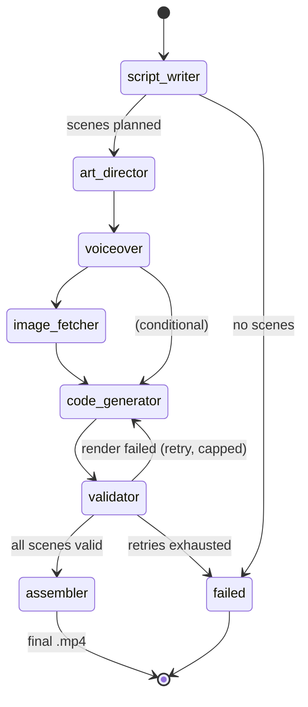
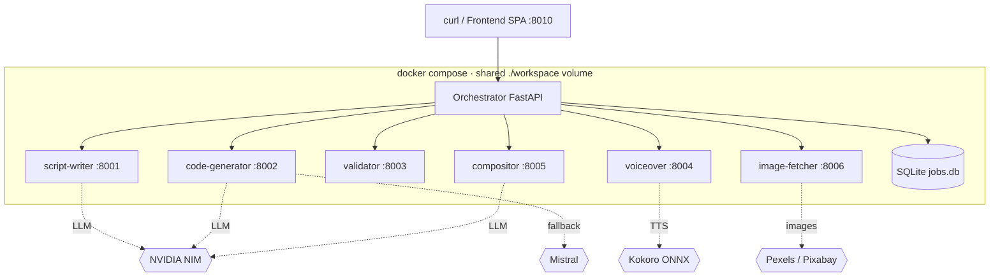
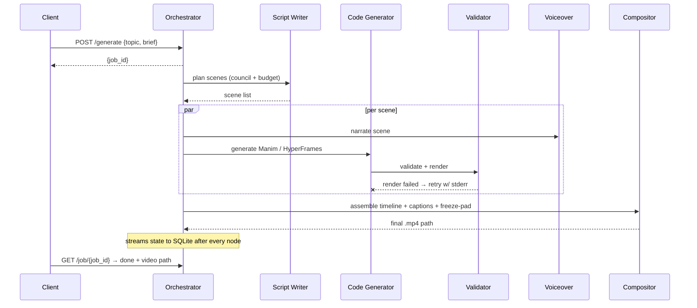

<!-- intro animation authored in this repo's own HyperFrames stack — assets/intro/index.html -->
<div align="center">


<h1>🎬 Manim Agent Network</h1>

<p>
  <strong>Give it a topic. Get back a fully narrated, animated explainer video</strong><br/>
  <em>— written, coded, rendered, voiced, and cut by a network of AI agents.</em>
</p>

<p>
  
  
  
</p>

<p>
  
  
  
  
  
  
  
  
  
  
  
</p>

<h3>
  <a href="#-quickstart"><strong>Quickstart</strong></a> &middot;
  <a href="#-what-it-does"><strong>What it does</strong></a> &middot;
  <a href="#-pipeline-architecture"><strong>Architecture</strong></a> &middot;
  <a href="#-engineering-highlights-the-hard-parts"><strong>Engineering Highlights</strong></a> &middot;
  <a href="#-api-contract"><strong>API</strong></a> &middot;
  <a href="#-configuration-reference"><strong>Config</strong></a> &middot;
  <a href="#-project-status"><strong>Status</strong></a>
</h3>

</div>

> **Status:** working prototype / portfolio project. The full pipeline runs end-to-end locally via `docker compose` and has produced frame-audited videos (see [Project Status](#-project-status)). It is **not** hardened for public deployment — see the honest scope notes at the bottom.

---

## ✨ Why this is interesting

Most "AI video" demos call one LLM and overlay text. The hard problem here is different: **making LLM-authored animation code render correctly and deterministically**, then debugging failures that only surface dozens of frames into a rendered clip — black canvases, silent `SyntaxError`s that kill composed scenes, clips that freeze mid-narration because a runtime drops the last frame.

This repo is the machine that solves that, end-to-end. **Seven independent microservices**, coordinated by a **LangGraph** state machine, each own one stage of turning a topic string into a narrated `.mp4`. It runs **fully local** via Docker Compose, uses **NVIDIA NIM** for inference and **offline Kokoro ONNX** for TTS, and renders two distinct animation kinds (math/diagram via Manim CE, motion-graphics via HyperFrames HTML/GSAP) into one timeline.

---

## 🎯 What it does

One HTTP request with a topic becomes a complete video.

<p align="center">
  
</p>


Each scene is one of two kinds:

- **Manim** scenes — mathematical/diagrammatic animations rendered by [Manim CE](https://manim.community/) (720p30 landscape).
- **HyperFrames** scenes — HTML/CSS/GSAP motion-graphics (titles, bullets, concept cards), rendered headless.

The **Compositor** stitches every scene, its narration, and timed captions into a single HyperFrames timeline and renders the final cut. *(The intro at the top of this README was authored in that same HyperFrames stack — source in [`assets/intro/`](assets/intro/index.html).)*

---

## ⚡ Feature highlights

<table>
<tr>
<td width="33%" valign="top">

### 🧠 Adaptive Script Council
Short topics get one writer + one reviewer. Long-form/study topics escalate to a **curriculum planner → parallel section writers → merge → reviewer**. Switch is duration/intent driven.

</td>
<td width="33%" valign="top">

### 📏 ±10% Duration Budget
A word-rate model (`2.2 words/sec`) plus a repair pass keeps the produced video within **±10%** of the requested target length — not "roughly".

</td>
<td width="33%" valign="top">

### 🩹 Self-Healing Renders
A failed render's **stderr is fed back** into the code generator as a retry prompt (capped). The system fixes its own mistakes instead of failing the job.

</td>
</tr>
<tr>
<td width="33%" valign="top">

### 🔒 Security AST Gate
Generated Python is **parsed and checked** for forbidden imports / builtins / APIs *before* it ever reaches a renderer. HyperFrames HTML is linted; lint errors feed the retry loop.

</td>
<td width="33%" valign="top">

### 🎙️ Offline TTS
Narration via **Kokoro ONNX** — CPU-capable, offline, preinstalled in the image. `edge_tts` is the network fallback when Kokoro fails.

</td>
<td width="33%" valign="top">

### 🖼️ Ranked Stock Imagery
Image Fetcher pulls per-term from Pexels/Pixabay, ranks with **SigLIP** (ONNX), then optionally vets relevance with a **vision LLM**.

</td>
</tr>
<tr>
<td width="33%" valign="top">

### 🔁 Resumable Jobs
State streams to SQLite after **every** graph node, so `/job/{id}` reflects live progress and timed-out jobs preserve script + render paths instead of clobbering them.

</td>
<td width="33%" valign="top">

### 🧩 Chunked Long-Form
Compositions over the chunk threshold render in **sequential chunks and concat**, to stay within memory and per-render timeouts.

</td>
<td width="33%" valign="top">

### 🔑 Multi-Key Round-Robin
`NVIDIA_API_KEYS` (comma-separated) round-robins across keys to raise throughput; a **Mistral** fallback covers NIM 429s on a separate quota.

</td>
</tr>
</table>

---

## 🆚 How it compares

| Capability | Manim Agent Network | One-shot "AI video" tools | Manual Manim authoring |
|:---|:---:|:---:|:---:|
| **Topic → full narrated video** | ✅ End-to-end, one request | ⚠️ Text-over-stock | ❌ Hand-coded |
| **Renders real Manim math animation** | ✅ Manim CE | ❌ | ✅ |
| **Motion-graphics scenes (HTML/GSAP)** | ✅ HyperFrames | ⚠️ Templates | ❌ |
| **Self-healing on render failure** | ✅ stderr → retry prompt | ❌ | ❌ (you debug) |
| **Deterministic seek-safe output** | ✅ re-encode + freeze-pad | ⚠️ | ⚠️ manual |
| **Security gate on generated code** | ✅ AST + HTML lint | ❌ | n/a |
| **Runs fully local / offline-ish** | ✅ NIM + Kokoro ONNX | ❌ Cloud only | ✅ |
| **Duration budget enforcement** | ✅ ±10% | ❌ | manual |

---

## 🏗 Pipeline architecture

| Service | Host port | Responsibility |
|---|---|---|
| **Orchestrator** | `8010` → 8000 | LangGraph state machine, job persistence (SQLite), public API, `/analyze` proxy, serves frontend |
| **Script Writer** | `8001` | Topic → scene plan (adaptive council, duration budget) via NVIDIA NIM |
| **Code Generator** | `8002` | Scene → Manim CE Python **or** HyperFrames HTML via NVIDIA NIM (Mistral fallback) |
| **Validator** | `8003` | AST security/deprecation gate, render, re-encode for seeking, HyperFrames lint |
| **Voiceover** | `8004` | Narration audio via Kokoro ONNX (CPU, offline) with retry + `edge_tts` fallback |
| **Image Fetcher** | `8006` | Stock imagery for HyperFrames scenes (Pexels/Pixabay → SigLIP → vision-LLM vet) |
| **Compositor** | `8005` (internal) | Build HyperFrames timeline + captions, freeze-pad, render & assemble final `.mp4` |

State flows through a typed `LangGraphState` dict; the orchestrator streams it to SQLite after every node so `/job/{id}` reflects live progress. Long compositions render in sequential chunks and concat, to stay within memory and per-render timeouts.

### LangGraph state machine

The actual node/edge wiring from [`services/orchestrator/app/core/graph.py`](services/orchestrator/app/core/graph.py):



### Deployment topology (single node)



### A single video job, end to end



---

## 🔬 Engineering highlights (the hard parts)

The hard part of this project was never "call an LLM" — it was making LLM-authored animation code render *correctly and deterministically*, then debugging failures that only show up dozens of frames into a rendered video. A few representative ones:

| Symptom | Root cause | Fix |
|---|---|---|
| **Every rendered video was black** | LLMs reliably write `config.background_color = WHITE` *inside* `construct()`, but Manim's camera initializes **before** `construct` runs — so the assignment is dead code. | Sanitizer strips all in-`construct` background assignments and injects a **module-level** `WHITE` unconditionally. |
| **Composed scenes rendered blank** | Inlining multiple scene scripts into one composition redeclared `const tl` → `SyntaxError` that silently killed every script after the first. | Mount each scene as a HyperFrames **sub-composition** (`data-composition-src`) so the compiler scopes, inlines, and auto-nests timelines natively. |
| **Valid scenes froze to black mid-clip** | Manim's default render emits keyframes ~4s apart; HyperFrames seeks frame-by-frame, landing between keyframes. | Validator **re-encodes** every render to 30fps, GOP 30, `+faststart`. |
| **Manim clip vanished before its narration finished** | The HyperFrames runtime does **not** hold a `<video>`'s last frame once playback passes the clip's intrinsic duration — it falls through to the white page background. | Compositor **freeze-pads** each clip's last frame to the narration slot (ffmpeg `tpad`); code generator now receives the scene **duration** and paces the animation to fill it. |
| **Timed-out long jobs lost all progress** | On wall-clock timeout the orchestrator persisted the empty *initial* state, clobbering progress streamed after every graph node. | Track the latest streamed state and persist it with `status=failed`, preserving script + render paths. |

A deeper write-up of two debugging sessions lives in [`docs/`](docs/) — see [`PIPELINE_FIX_REPORT_2026-06-10.md`](docs/PIPELINE_FIX_REPORT_2026-06-10.md) and [`VIDEO_QA_REPORT_f24799da.md`](docs/VIDEO_QA_REPORT_f24799da.md).

---

## 🚀 Quickstart

**Prerequisites:** Docker + Docker Compose, an [NVIDIA NIM](https://build.nvidia.com/) API key. (Optional: NVIDIA Container Toolkit for GPU TTS/SigLIP — falls back to CPU without it.)

```bash
git clone https://github.com/vigneshvicky567/video-gen.git
cd video-gen/manim-agent-network

cp .env.template .env        # then add your key:
#   NVIDIA_API_KEY=nvapi-...

make build                   # build all images
make run                     # start the fleet
```

Generate a video (orchestrator is on host port **8010**):

```bash
# Simple topic
curl -X POST http://localhost:8010/generate \
  -H "Content-Type: application/json" \
  -d '{"topic": "The Pythagorean theorem, visually"}'
# → {"job_id": "abc-123", "message": "Generation started."}

# With a duration + audience brief (optional, fully backward-compatible)
curl -X POST http://localhost:8010/generate \
  -H "Content-Type: application/json" \
  -d '{"topic": "Dijkstra'\''s algorithm",
       "brief": {"target_duration_seconds": 300, "audience_level": "intermediate"}}'

# Poll status (script + render paths appear as the job streams)
curl http://localhost:8010/job/abc-123
```

Finished videos land in `workspace/outputs/<job_id>_final.mp4`. `make logs` tails the fleet. The frontend SPA is served from the orchestrator at [http://localhost:8010](http://localhost:8010).

| Surface | URL |
|---|---|
| **Frontend / Studio** | [http://localhost:8010](http://localhost:8010) |
| **Orchestrator API** | [http://localhost:8010/health](http://localhost:8010/health) |
| **Per-service docs** | `http://localhost:800{1..6}/docs` (FastAPI auto docs) |

---

## 📡 API contract

The **Orchestrator** ([`services/orchestrator/app/main.py`](services/orchestrator/app/main.py)) is the public surface:

### Generation & jobs
- `POST /analyze` — classify a topic (intent, suggested duration) → `TopicAnalysis`.
- `POST /generate` — start a job. Body: `{topic, brief?}`. Returns `{job_id}`.
- `GET /job/{job_id}` — full job state (status, script, render paths, final video).
- `POST /job/{job_id}/cancel` — cancel a running job.
- `POST /job/{job_id}/resume` — resume a failed/cancelled job from persisted state.
- `GET /jobs` — list all jobs.

### Video delivery
- `GET /video/{job_id}` — stream the final assembled `.mp4`.
- `GET /video/{job_id}/scene/{scene_id}` — stream an individual rendered scene.

### Health
- `GET /health` — orchestrator liveness.
- `GET /services/health` — fan-out health of all seven services.

### Internal service endpoints (called by the orchestrator)
| Service | Endpoint |
|---|---|
| Script Writer | `POST /generate`, `POST /analyze`, `GET /health` |
| Code Generator | `POST /generate`, `GET /health` |
| Validator | `POST /validate`, `GET /health` |
| Voiceover | `POST /generate`, `GET /health` |
| Image Fetcher | `POST /fetch`, `GET /health` |
| Compositor | `POST /assemble`, `POST /lint`, `GET /health` |

---

## ⚙ Configuration reference

Full list in [`shared/config.py`](shared/config.py). The knobs you actually touch:

| Variable | Default | Description |
|---|---|---|
| `NVIDIA_API_KEY` | — | **Required.** NVIDIA NIM key. |
| `NVIDIA_API_KEYS` | — | Comma-separated keys; round-robins to raise throughput. |
| `SCRIPT_WRITER_MODEL` | `moonshotai/kimi-k2-instruct` | Script model |
| `CODE_GENERATOR_MODEL` | `qwen/qwen3-coder-480b-a35b-instruct` | Code model |
| `COMPOSITOR_LLM_MODEL` | `moonshotai/kimi-k2-instruct` | Composition / keyword model |
| `MISTRAL_API_KEY` | — | Optional fallback when NIM 429s (separate quota) |
| `RENDER_MODE` | `hybrid` | `manim` / `hyperframes` / `hybrid` scene mix |
| `COUNCIL_FULL_THRESHOLD_SECONDS` | `600` | Target length above which the full council engages |
| `COUNCIL_MAX_PARALLEL_WRITERS` | `4` | Parallel section writers for long-form |
| `SCRIPT_WORDS_PER_SECOND` | `2.2` | Word-rate model for duration budgeting |
| `SCRIPT_DURATION_TOLERANCE` | `0.10` | Duration budget band (±10%) |
| `VOICEOVER_PROVIDER` / `KOKORO_VOICE` | `kokoro` / `af_sarah` | TTS engine and voice |
| `VOICEOVER_FALLBACK_PROVIDER` | `edge_tts` | Network TTS fallback |
| `PEXELS_API_KEY` / `PIXABAY_API_KEY` | — | Stock image sources (else Wikimedia) |
| `IMAGE_EVAL_MODEL` | — | Vision LLM for image relevance vet (empty → SigLIP only) |
| `ORCH_CODEGEN_CONCURRENCY` | `3` | Parallel code-gen scenes |
| `ORCH_VOICEOVER_CONCURRENCY` | `4` | Parallel narration scenes |
| `JOB_TIMEOUT_BASE_SECONDS` | `1800` | Base per-job wall-clock budget (scales w/ target length) |
| `COMPOSITOR_CHUNK_THRESHOLD_SECONDS` | `480` | Above this, render in chunks + concat |

---

## 📁 Project structure

```
manim-agent-network/
├── services/                       # 7 FastAPI microservices
│   ├── orchestrator/app/
│   │   ├── core/graph.py           # LangGraph state machine (nodes + routers)
│   │   ├── db.py                   # SQLite job persistence
│   │   └── main.py                 # Public API + frontend serving
│   ├── script-writer/app/
│   │   ├── analyzer.py             # Topic intent / duration classifier
│   │   ├── council.py              # Adaptive multi-writer council
│   │   ├── budget.py               # ±10% duration word-rate model
│   │   └── main.py
│   ├── code-generator/app/
│   │   ├── sanitizer.py            # Strips dead bg assignments, injects WHITE
│   │   ├── prompts/                # Versioned Manim + HyperFrames prompts
│   │   └── main.py
│   ├── validator/app/main.py       # AST security gate + render + re-encode
│   ├── voiceover/app/main.py       # Kokoro ONNX TTS + edge_tts fallback
│   ├── image-fetcher/app/
│   │   ├── pexels_client.py · pixabay_client.py · wikimedia_client.py
│   │   ├── siglip_scorer.py        # ONNX relevance ranking
│   │   ├── relevance_llm.py        # Vision-LLM final vet
│   │   └── main.py
│   └── compositor/app/
│       ├── chunking.py             # Long-form chunk + concat
│       ├── duration_prober.py      # ffprobe scene durations
│       ├── llm_composer.py         # Timeline + caption assembly
│       └── main.py
├── shared/config.py                # All env-driven config (single source)
├── infrastructure/docker/          # Per-service Dockerfiles + base image
├── frontend/                       # Static SPA (landing + studio), served by orchestrator
├── docs/                           # Debugging write-ups + QA reports
├── tests/                          # 118-test pytest suite
├── assets/                         # intro.gif, pipeline/shot screenshots, intro/ source
├── docker-compose.yml              # 7-service fleet + shared workspace volume
├── Makefile                        # build / run / logs targets
└── README.md
```

---

## 🧪 Testing

```bash
python -m pytest tests/ -q          # 118 passing
```

The **112 pure-logic units** (council switching + duration budget, caption chunking, timeout math, compositor timing, validator AST gate, freeze-pad with real ffmpeg) run anywhere. A further **six LaTeX-dependent tests** need a TeX install — it ships in the validator image, so the full **118 pass there**. Standalone host harnesses for probing the live services live in [`_manual_tests/`](_manual_tests/).

---

## 🛠 Tech stack

**Python 3.11** · FastAPI · LangGraph · Pydantic · **Manim CE** · **HyperFrames** (HTML/GSAP video) · **NVIDIA NIM** (LLM inference) · **Mistral** (fallback) · **Kokoro ONNX** (offline TTS) · `edge_tts` · **SigLIP ONNX** (image ranking) · ffmpeg · SQLite · Docker Compose.

---

## 🗺 Roadmap

- [x] Manim render quality: 480p15 portrait → **720p30 landscape**
- [x] Deterministic Python HyperFrames composition (no LLM in the hot path)
- [x] NVIDIA NIM direct httpx client (dropped OpenAI SDK)
- [x] Kokoro ONNX as primary offline TTS with long-text chunking
- [x] Health-check test suite + 118 passing tests
- [ ] Frame-audit the Manim duration-pacing fix on a real render
- [ ] Auth + rate limiting on the public API
- [ ] CI pipeline + dependency lockfile
- [ ] Horizontal scale (replace SQLite + in-process tasks + single render browser)

---

## 📊 Project Status

**What works (verified):**
- Full topic → `.mp4` pipeline runs end-to-end via `docker compose`; multiple frame-audited sample outputs (e.g. an 8-scene "gradient descent" explainer rendered clean — white Manim canvases, correct captions, no seek-freezes).
- Adaptive council verified live against NVIDIA NIM across short/long/study/legacy inputs.
- 118 automated tests passing.

**Deliberately out of scope (it's a prototype, not a product):**
- **No authentication / rate limiting** on the API — single-user local use only.
- **Single-node**: SQLite + in-process background tasks + one render browser. Not built to scale horizontally.
- Containers aren't hardened (root user, no resource limits) and there's no CI yet.
- Python deps use `>=` ranges (no lockfile); the render-sensitive HyperFrames CLI **is** pinned.

**Known polish:** analyzer occasionally under-classifies study material; an outro card's text can sit close to the caption strip. The Manim duration-pacing fix is verified at code-gen level but not yet frame-audited on a real Manim render.

---

## ❓ FAQ

<details>
<summary><strong>Click to expand</strong></summary>

**Q: Can I run it without a GPU?**
Yes. Kokoro TTS and SigLIP scoring use `onnxruntime` and fall back to CPU automatically — comment out the `deploy.resources` GPU blocks in `docker-compose.yml` if you have no NVIDIA Container Toolkit.

**Q: Do I need an API key?**
You need an NVIDIA NIM key (`NVIDIA_API_KEY`) for the LLM stages. Image keys (Pexels/Pixabay) are optional — without them the fetcher falls back to Wikimedia. TTS is fully offline.

**Q: Manim vs HyperFrames — when does each get used?**
`RENDER_MODE=hybrid` (default) lets the code generator pick per scene: Manim for math/diagram animation, HyperFrames for titles/bullets/concept cards. Force one with `RENDER_MODE=manim` or `hyperframes`.

**Q: What happens when a generated render fails?**
The render's stderr is fed back to the code generator as a retry prompt (capped). If retries exhaust, the validator routes the job to `failed` with state preserved.

**Q: How long can videos be?**
Long-form is supported via the adaptive council and chunked compositing (render in chunks + concat above `COMPOSITOR_CHUNK_THRESHOLD_SECONDS`). Per-job wall-clock budget scales with the requested target length.

**Q: Where do outputs go?**
`workspace/outputs/<job_id>_final.mp4`. Individual scenes are under `workspace/temp/<job_id>/`.

</details>

---

## 📄 License

MIT — see [LICENSE](LICENSE).

## 🙏 Acknowledgments

[Manim CE](https://manim.community/) · [LangGraph](https://langchain-ai.github.io/langgraph/) · [NVIDIA NIM](https://build.nvidia.com/) · [Kokoro ONNX](https://github.com/thewh1teagle/kokoro-onnx) · HyperFrames (HTML/GSAP rendering).
