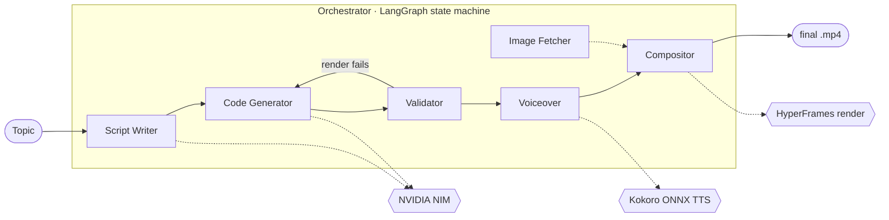

<!-- intro animation authored in this repo's own HyperFrames stack — assets/intro/index.html -->
<p align="center">
  
</p>

<h1 align="center">Manim Agent Network</h1>

<p align="center">
  <em>Give it a topic. Get back a fully narrated, animated explainer video — written, coded, rendered, voiced, and cut by a network of AI agents.</em>
</p>

<p align="center">
  
  
  
  
  
</p>

> **Status:** working prototype / portfolio project. The full pipeline runs end-to-end locally via `docker compose` and has produced frame-audited videos (see [Project Status](#-project-status)). It is **not** hardened for public deployment — see the honest scope notes at the bottom.

---

## What it does

One HTTP request with a topic becomes a complete video. Seven services, coordinated by a **LangGraph** state machine, each own one stage:

<p align="center">
  
</p>



Each scene is one of two kinds:

- **Manim** scenes — mathematical/diagrammatic animations rendered by [Manim CE](https://manim.community/).
- **HyperFrames** scenes — HTML/CSS/GSAP motion-graphics (titles, bullets, concept cards), rendered headless.

The **Compositor** stitches every scene, its narration, and timed captions into a single HyperFrames timeline and renders the final cut. *(The intro at the top of this README was authored in that same HyperFrames stack — source in [`assets/intro/`](assets/intro/index.html).)*

---

## Why it's interesting (engineering highlights)

The hard part of this project was never "call an LLM" — it was making LLM-authored animation code render *correctly and deterministically*, then debugging failures that only show up dozens of frames into a rendered video. A few representative ones:

| Symptom | Root cause | Fix |
|---|---|---|
| **Every rendered video was black** | LLMs reliably write `config.background_color = WHITE` *inside* `construct()`, but Manim's camera initializes **before** `construct` runs — so the assignment is dead code. | Sanitizer strips all in-`construct` background assignments and injects a **module-level** `WHITE` unconditionally. |
| **Composed scenes rendered blank** | Inlining multiple scene scripts into one composition redeclared `const tl` → `SyntaxError` that silently killed every script after the first. | Mount each scene as a HyperFrames **sub-composition** (`data-composition-src`) so the compiler scopes, inlines, and auto-nests timelines natively. |
| **Valid scenes froze to black mid-clip** | Manim's default render emits keyframes ~4s apart; HyperFrames seeks frame-by-frame, landing between keyframes. | Validator **re-encodes** every render to 30fps, GOP 30, `+faststart`. |
| **Manim clip vanished before its narration finished** | The HyperFrames runtime does **not** hold a `<video>`'s last frame once playback passes the clip's intrinsic duration — it falls through to the white page background. | Compositor **freeze-pads** each clip's last frame to the narration slot (ffmpeg `tpad`); code generator now receives the scene **duration** and paces the animation to fill it. |
| **Timed-out long jobs lost all progress** | On wall-clock timeout the orchestrator persisted the empty *initial* state, clobbering progress streamed after every graph node. | Track the latest streamed state and persist it with `status=failed`, preserving script + render paths. |

Other things worth a look:

- **Adaptive script council** — short topics get one writer + one reviewer; long-form/study topics escalate to a curriculum planner → parallel section writers → merge → reviewer. Switch is duration/intent driven and enforces a **±10% duration budget** via a word-rate model and a repair pass.
- **Self-healing renders** — a failed render's stderr is fed back into the code generator as a retry prompt (capped), so the system fixes its own mistakes instead of failing the job.
- **Security AST gate** — generated Python is parsed and checked for forbidden imports/builtins/APIs *before* it ever reaches a renderer; HyperFrames HTML is linted and lint errors feed the retry loop.

A deeper write-up of two debugging sessions lives in [`docs/`](docs/).

---

## Architecture

| Service | Host port | Responsibility |
|---|---|---|
| **Orchestrator** | `8010` → 8000 | LangGraph state machine, job persistence (SQLite), public API, `/analyze` proxy |
| **Script Writer** | `8001` | Topic → scene plan (adaptive council, duration budget) via NVIDIA NIM |
| **Code Generator** | `8002` | Scene → Manim CE Python **or** HyperFrames HTML via NVIDIA NIM |
| **Validator** | `8003` | AST security/deprecation gate, render, re-encode for seeking, HyperFrames lint |
| **Voiceover** | `8004` | Narration audio via Kokoro ONNX (CPU, offline) with retry |
| **Image Fetcher** | `8006` | Stock imagery for HyperFrames scenes (Pexels) |
| **Compositor** | internal | Build HyperFrames timeline + captions, freeze-pad, render & assemble final `.mp4` |

State flows through a typed `LangGraphState` dict; the orchestrator streams it to SQLite after every node so `/job/{id}` reflects live progress. Long compositions (>8 min) render in sequential chunks and concat, to stay within memory and per-render timeouts.

---

## Quickstart

**Prerequisites:** Docker + Docker Compose, an [NVIDIA NIM](https://build.nvidia.com/) API key.

```bash
git clone https://github.com/vigneshvicky567/video-gen.git
cd video-gen/manim-agent-network

cp .env.template .env        # then add your key:
#   NVIDIA_API_KEY=nvapi-...

make build                   # build all images
make run                     # start the fleet
```

Generate a video (orchestrator is on host port **8010**):

```bash
# Simple topic
curl -X POST http://localhost:8010/generate \
  -H "Content-Type: application/json" \
  -d '{"topic": "The Pythagorean theorem, visually"}'
# → {"job_id": "abc-123", "message": "Generation started."}

# With a duration + audience brief (optional, fully backward-compatible)
curl -X POST http://localhost:8010/generate \
  -H "Content-Type: application/json" \
  -d '{"topic": "Dijkstra'\''s algorithm",
       "brief": {"target_duration_seconds": 300, "audience_level": "intermediate"}}'

# Poll status (script + render paths appear as the job streams)
curl http://localhost:8010/job/abc-123
```

Finished videos land in `workspace/outputs/<job_id>_final.mp4`. `make logs` tails the fleet.

---

## Configuration

| Variable | Default | Description |
|---|---|---|
| `NVIDIA_API_KEY` | — | **Required.** NVIDIA NIM key. `NVIDIA_API_KEYS` (comma-separated) round-robins across keys to raise throughput. |
| `SCRIPT_WRITER_MODEL` | `moonshotai/kimi-k2-instruct` | Script model |
| `CODE_GENERATOR_MODEL` | `qwen/qwen3-coder-480b-a35b-instruct` | Code model |
| `COUNCIL_FULL_THRESHOLD_SECONDS` | `600` | Target length above which the full council engages |
| `VOICEOVER_PROVIDER` / `KOKORO_VOICE` | `kokoro` / `af_sarah` | TTS engine and voice |
| `JOB_WALLCLOCK_TIMEOUT_SECONDS` | `3600` | Hard ceiling per job (scales for long-form) |

Full list with long-form/chunking/concurrency knobs is in [`shared/config.py`](shared/config.py).

---

## Testing

```bash
python -m pytest tests/ -q          # 118 passing
```

The 112 pure-logic units (council switching + duration budget, caption chunking, timeout math, compositor timing, validator AST gate, freeze-pad with real ffmpeg) run anywhere. A further six LaTeX-dependent tests need a TeX install — it ships in the validator image, so the full **118 pass there**. Standalone host harnesses for probing the live services live in [`_manual_tests/`](_manual_tests/).

---

## Tech stack

**Python** · FastAPI · LangGraph · Pydantic · **Manim CE** · **HyperFrames** (HTML/GSAP video) · **NVIDIA NIM** (LLM inference) · **Kokoro ONNX** (offline TTS) · ffmpeg · SQLite · Docker Compose.

---

## 📊 Project Status

**What works (verified):**
- Full topic → `.mp4` pipeline runs end-to-end via `docker compose`; multiple frame-audited sample outputs (e.g. an 8-scene "gradient descent" explainer rendered clean — white Manim canvases, correct captions, no seek-freezes).
- Adaptive council verified live against NVIDIA NIM across short/long/study/legacy inputs.
- 118 automated tests passing.

**Deliberately out of scope (it's a prototype, not a product):**
- **No authentication / rate limiting** on the API — single-user local use only.
- **Single-node**: SQLite + in-process background tasks + one render browser. Not built to scale horizontally.
- Containers aren't hardened (root user, no resource limits) and there's no CI yet.
- Python deps use `>=` ranges (no lockfile); the render-sensitive HyperFrames CLI **is** pinned.

**Known polish:** analyzer occasionally under-classifies study material; an outro card's text can sit close to the caption strip. The Manim duration-pacing fix is verified at code-gen level but not yet frame-audited on a real Manim render.

---

## License

MIT — see [LICENSE](LICENSE).

## Acknowledgments

[Manim CE](https://manim.community/) · [LangGraph](https://langchain-ai.github.io/langgraph/) · [NVIDIA NIM](https://build.nvidia.com/) · [Kokoro ONNX](https://github.com/thewh1teagle/kokoro-onnx) · HyperFrames (HTML/GSAP rendering).
