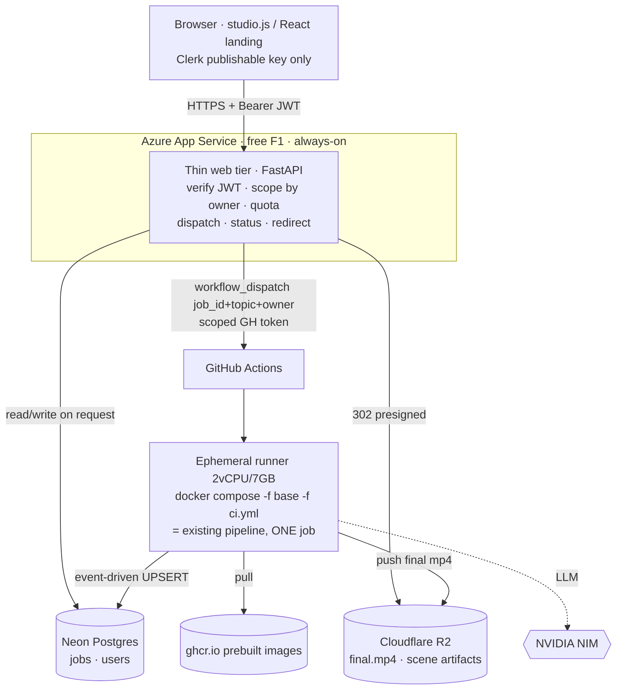
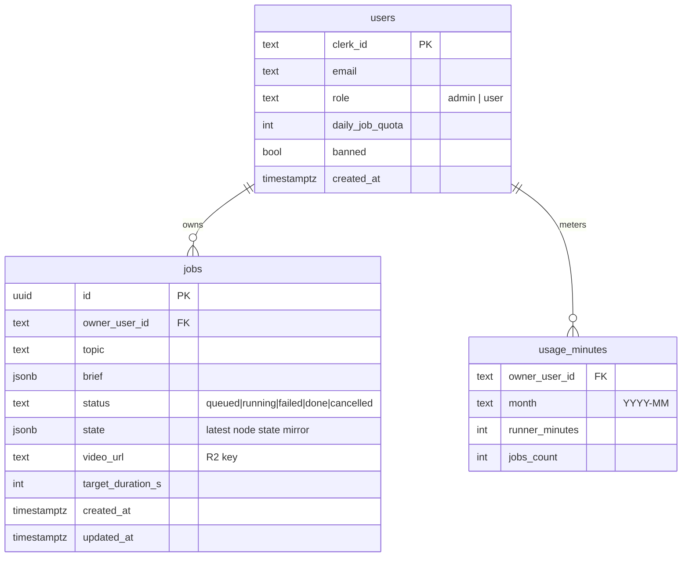

# Deployment Spec — GitHub Actions Hybrid (free, June 2026)

**Date:** 2026-06-21
**Branch:** `deploy/hybrid-spec`
**Status:** Approved design, pre-implementation. Grounded in a code-mapping + adversarial-validation workflow (6 agents) against the real pipeline.
**Supersedes:** `2026-06-21-digitalocean-deploy-design.md` (DigitalOcean student credit was discontinued — see §2).

---

## 1. Goal

Host the existing 7-service Manim Agent Network publicly, **for $0**, using GitHub Student Pack benefits — without re-architecting the pipeline. Heavy rendering runs on ephemeral GitHub Actions runners (one job per runner, isolated → no OOM cascade); a thin always-on web tier accepts requests, dispatches render jobs, and serves results.

## 2. Verified landscape (June 2026) — why the plan is what it is

Web-researcher + in-repo verified:

- **DigitalOcean exited the GitHub Student Pack** — credits expire **2026-07-31**. The "$200 droplet for 5 months" plan is dead.
- **Oracle Always Free A1 halved** (2026-06-14) to **2 OCPU / 12 GB** — OOM-risky for this stack + capacity lottery + 7-day idle reclaim.
- **Hetzner** (CAX31 16 GB ARM ~€8/mo) is the cheapest *reliable* paid option, kept as the documented escape hatch.
- **GitHub Pro (Student Pack)** = **3000 private Actions minutes/mo** → repo can stay **private**; renders run free up to the cap.
- **Cloudflare R2**: zero egress, 10 GB free. **Neon** free: 100 CU-hr/mo, 0.5 GB, autosuspend. **Clerk** free: 50k MRU. **Datadog Pro** (student): 2 yr, 10 servers, APM included. **Namecheap** free `.me` domain 1 yr.

## 3. Locked decisions

| Decision | Choice |
|---|---|
| **Heavy compute** | GitHub Actions ephemeral runners (2 vCPU / 7 GB / 14 GB SSD), one job per runner |
| **Render images** | Prebuilt, pushed to **ghcr.io**, pulled per job (never built on the runner) |
| **Web tier** | Thin FastAPI on **Azure App Service free F1** ($100 credit as fallback if F1 throttles) |
| **Object storage** | **Cloudflare R2** (final mp4 + cross-runner scene artifacts), served via short-TTL presigned URLs |
| **Database** | **Neon** Postgres free — job/user state, written **event-driven** by the runner |
| **Auth** | **Clerk**, 2 roles (admin/user), per-user job scoping + quotas |
| **Repo** | **Private** (3000 Actions min/mo via Pro) |
| **Observability** | **Datadog Pro** (student), capped — Milestone 2 |
| **Domain / ingress** | Namecheap `.me` → Azure web tier HTTPS endpoint (Cloudflare Tunnel only if web tier moves off a public host) |

---

## 4. Target architecture



**Flow:** `POST /generate` → web tier validates Clerk JWT, checks quota, writes Neon job row (`status=queued`, owner stamped), fires `workflow_dispatch` (fire-and-forget; the dispatch returns no run id — correlation is by the `job_id` we pass) → runner spins up, runs the existing compose pipeline for one job, **UPSERTs status to Neon at each node transition**, pushes final mp4 to R2 → client polls `GET /job/{id}` (web tier reads Neon on demand), plays via `GET /video/{id}` (302 → short-TTL R2 presigned URL).

### Ground-truth pipeline (verified, unchanged inside the runner)
`script_writer → art_director → voiceover → image_fetcher → code_generator → validator ⟲(retry ≤5) → assembler → END`. Linear with one retry loop. Voiceover runs **before** code-gen (feeds audio cues for A/V sync). Services hand off via absolute `/workspace` paths in a shared bind mount, state persisted after every node (`db.update_job`), no idle polling. Heavy services: **validator** (Manim subprocess + LaTeX + ffmpeg, 90–600 s/scene), **compositor** (headless Chromium + hyperframes + ffmpeg), **voiceover** (Kokoro ONNX ~500 MB), **image-fetcher** (SigLIP ONNX). Light: orchestrator, script-writer, code-generator (LLM-bound).

---

## 5. Two render variants

| | Variant A (default) | Variant B (long videos) |
|---|---|---|
| **Trigger** | `target_duration_seconds ≤ ~8–10 min` | above the threshold |
| **Shape** | one runner runs the **full compose** end-to-end for one job | 3 chained workflows: **prep** (script+vo+images+codegen → upload per-scene code+audio to R2) → **matrix render** (≤10 parallel runners, each renders ONE scene via validator → scene `.mp4` to R2) → **assemble** (one runner downloads all scene artifacts, runs **only** compositor concat → final to R2) |
| **Why** | simplest; `/workspace` single-host handoff works free | beats the **GitHub 6 h job cap**; validator at concurrency 1 on 2 vCPU serializes long jobs past 6 h on a single runner |
| **Cost note** | ~one runner's wall-clock | matrix **multiplies billed minutes** (N runners each bill wall-clock) — saves latency, **not** minutes |
| **Storage** | local `/workspace` only | every cross-runner artifact round-trips R2 (`jobs/{job_id}/scenes/{scene_id}.mp4`) — absolute paths are **not** portable across runners |

Threshold is set by measuring one real long render's wall-clock against the 6 h cap. Route at dispatch on `target_duration_seconds`.

---

## 6. CI workflow design

### `.github/workflows/render-job.yml` (Variant A)
```yaml
on:
  workflow_dispatch:
    inputs: { job_id: {required: true}, topic: {required: true}, brief: {}, owner: {} }
concurrency: { group: render-${{ inputs.job_id }}, cancel-in-progress: false }
jobs:
  render:
    runs-on: ubuntu-latest          # 2 vCPU / 7 GB / 14 GB SSD
    timeout-minutes: 350            # < 360 hard cap, leaves flush margin
    steps:
      1. checkout (compose + override files only)
      2. docker login ghcr.io
      3. write .env from ${{ secrets.* }}; mkdir -p ./workspace
      4. docker compose -f docker-compose.yml -f docker-compose.ci.yml pull   # shared base layer pulled once
      5. docker compose ... up -d
      6. wait-for-health: curl orchestrator /services/health (covers model load + LaTeX warmup)
      7. POST orchestrator /generate; poll orchestrator /job/{id} IN-RUNNER (localhost, free);
         mirror each status change to Neon via psql UPSERT (event-driven)
      8. on completed: push ./workspace/outputs/{id}_final.mp4 → r2://bucket/jobs/{JOB_ID}/final.mp4;
         UPSERT Neon status=completed, video_url
      9. always(): if not terminal → UPSERT status=failed (reason); dump compose logs; compose down -v
```
- **Watchdog:** a step at ~5 h40 m force-writes `status=failed (runner wallclock)` to Neon so a 6 h kill never leaves Neon stuck on `running`.
- **Spending limit = $0** on the GitHub account so exhaustion **queues/fails, never bills**.
- **Concurrency cap** in the workflow + global cap at the web tier so a burst can't drain the month.

### `docker-compose.ci.yml` (runner override — deltas vs base)
- **Remove** `voiceover.deploy.resources` and `image-fetcher.deploy.resources` GPU reservation blocks — GitHub runners have no GPU; the `onnxruntime-gpu` CUDA load hard-fails. *(Critical: R1.)*
- **Omit the `image-fetcher` service entirely** — it is degradable (orchestrator returns empty `image_paths` and continues, confirmed `graph.py`), and it is the ~800 MB+ `onnxruntime-gpu` risk. Reclaims RAM. *(If stock images are required later: swap its wheel to CPU `onnxruntime` and budget ~800 MB.)* Adjust `orchestrator.depends_on` accordingly.
- **`VALIDATOR_MAX_CONCURRENT_RENDERS=1`** explicitly (don't trust `cpu_count//2`).
- **`mem_limit`** per service so Docker OOM-kills one container instead of the kernel killing random PIDs: `validator 3g`, `compositor 1.5g`, `voiceover 1g`, others `512m`. Linear graph keeps validator and compositor peaks **non-overlapping** — do not parallelize them on one runner.
- **`JOB_TIMEOUT_MAX_SECONDS=20000`** (below the 6 h cap; today it equals 21600 = the cap, so the GH kill wins the race).

### Image prebuild
Separate on-merge/scheduled workflow builds the 7 images sharing the `base-manim-agent` layer, pushes to ghcr.io. Runner pulls (base layer once). Budget **~4–7 min cold overhead per job** (provision + multi-image pull + model load + LaTeX warmup). 14 GB runner SSD is tight with 4–6 GB images + renders + LaTeX cache → prune between steps; monitor disk.

---

## 7. Dispatch round-trip — the one correct design

**Runner writes Neon (event-driven). Web tier reads Neon on user request only.**

- Reuse the orchestrator's existing per-node `db.update_job` hook → add a thin shim that UPSERTs job `status` + `video_url` to Neon at transitions (started, major nodes, completed/failed). Event-driven, **not** a timer → respects Neon autosuspend + 100 CU-hr budget.
- **Do NOT poll the GitHub Actions API** for status: `workflow_dispatch` returns no run id; list-and-correlate is racy + rate-limited.
- **Do NOT timer-poll Neon** from the web tier: that defeats autosuspend and burns CU-hrs. The client polls `GET /job/{id}`; the web tier reads Neon only when a request arrives (so Neon wakes only when a user is watching). Client backs off polling once a job is terminal; web tier may keep a short in-memory cache so 1 s polls don't each hit Neon.

---

## 8. Web tier (Azure F1)

Thin FastAPI — **no rendering, no LangGraph**. Endpoints:
- `POST /generate` — verify Clerk JWT, check per-user daily quota + global concurrency, insert Neon job (owner stamped), fire `workflow_dispatch` (scoped GH token), return `job_id`.
- `GET /job/{id}`, `GET /jobs` — Neon read, **owner-filtered** (404 on mismatch, never 403 — no existence leak).
- `GET /video/{id}`, `/video/{id}/scene/{sid}` — owner check → 302 to short-TTL R2 presigned URL.
- `POST /analyze` — proxy to script-writer (can run as its own tiny Actions dispatch or a synchronous NIM call; lightweight).
- `GET /health`, `GET /admin/*` (Milestone 2).

Pin **free F1** (thin tier fits F1's 60 CPU-min/day). Azure budget alert at $1; calendar the credit-expiry date. If F1 throttles, step up funded by the $100 credit.

---

## 9. Storage & data model

### Cloudflare R2
- Buckets/keys: `jobs/{job_id}/final.mp4`, `jobs/{job_id}/scenes/{scene_id}.mp4`, `jobs/{job_id}/scenes/{scene_id}_audio.wav` (Variant B).
- **Served only via short-TTL presigned URLs minted by the web tier after Clerk + owner check.** Never a public bucket / public custom-domain read — otherwise storage is an auth bypass (DATA-1).

### Neon Postgres

- `jobs.state` mirrors the orchestrator's per-node state (the existing SQLite `state_json`, now in Neon).
- `usage_minutes` powers the dispatch budget gate (refuse new jobs past a monthly Actions-minute threshold) + analytics.
- Local SQLite **stays inside the runner** as the orchestrator's working store; Neon is the durable cross-tier mirror.

---

## 10. Authentication — Clerk (admin / user)

- Browser holds **only** the Clerk publishable key; every API call carries `Authorization: Bearer <session JWT>`.
- Web tier validates the JWT against Clerk JWKS (networkless), extracts `clerk_id` + `role`.
- **Per-user scoping:** `/generate` stamps `owner_user_id`; `/job`, `/jobs`, `/video` filter by owner, **404 on mismatch**.
- **Quotas:** per-user daily job cap + global concurrency cap at the web tier — so neither an attacker nor a logged-in user can drain the monthly Actions minutes / NIM quota. This simultaneously closes AUTH-1 and de-risks the Actions-ToS question (POLICY-1).
- Frontend: `studio.html` loads ClerkJS (vanilla) + attaches token in the fetch wrapper; React landing wraps `<ClerkProvider>`.
- The `workflow_dispatch` token is server-side only (Azure App Settings), never in the browser.

---

## 11. Secrets & the leaked-key incident

### The incident (verified in git, not assumed)
- **Current** live keys (`nvapi-hs5bxbAMW5Ar…`, Mistral, Pexels, LangSmith) live **only** in the gitignored working-tree `.env` — **absent from HEAD and all history**. (The earlier brief's "current keys committed" claim was **false**.)
- A **stale** NVIDIA key `nvapi-80infK…` **was committed** in `manim-agent-network/.env` across commits `2e87a3f`, `74d33f9`, `e2deedb`, all **reachable from `origin/ver-2.0`** on the public remote `github.com/vigneshvicky567/video-gen`. `origin/main`'s `.env` commits are 0-byte (clean). Treat the stale key as **compromised**.

### Remediation (ordered, pre-go-live)
1. **Revoke** `nvapi-80infK…` in the NVIDIA console now (makes the leak inert immediately).
2. **Scrub history:** delete stale remote branches (`jules-*`, `feature/*`), `git filter-repo --path manim-agent-network/.env --invert-paths` on `ver-2.0`, force-push. `main` needs no rewrite. **Make the repo private.** (Private ≠ substitute for revocation.)
3. Add **gitleaks/trufflehog** pre-commit hook + a CI gitleaks gate so a future `.env`/inline key fails the build.

### Three-vault secret model
| Vault | Holds |
|---|---|
| **GitHub Actions repo secrets** (runner) | `NVIDIA_API_KEY`, `NVIDIA_API_KEYS`, `MISTRAL_API_KEY`, `PEXELS_API_KEY`, `PIXABAY_API_KEY`, `LANGSMITH_API_KEY`, R2 write creds, Neon DSN |
| **Azure App Settings / Key Vault** (web tier) | Neon DSN, R2 creds (presigning), Clerk secret key, scoped GH dispatch token |
| **Clerk dashboard + browser** | Clerk keys; only the **publishable** key ever reaches the browser |

NVIDIA/Mistral/render secrets **never** touch the web tier or browser — only the runner needs them. In workflows, reference `${{ secrets.X }}` as step `env:` only, never echo. Note: `NVIDIA_API_KEYS` is 3 keys on **one** ~40 RPM account — real 3× scaling requires 3 **separate** accounts; keep `NVIDIA_RPM` low so `RPM × keys < 40`.

---

## 12. Resource budget (Variant A, single 7 GB runner)

Usable ~6.3 GB after Docker/OS. Linear graph → validator peak and compositor peak **don't overlap** for one job. With image-fetcher dropped + `VALIDATOR_MAX_CONCURRENT_RENDERS=1` + mem_limits: resident ~3 GB, transient validator+LaTeX spike toward ~4.7 GB → fits with a thin margin. mem_limits convert a runaway render into a single-container OOM-kill instead of a kernel kill.

---

## 13. Cost model — $0 verification + silent-bill traps

**Genuinely $0 at moderate portfolio scale** if: Actions spending limit = $0, Azure pinned to F1, Datadog dropped-or-capped. R2 (zero egress) + Neon free are safe.

Capacity: **3000 Actions min/mo ≈ 30–100 short videos** (renders are wall-clock-heavy; ~4–7 min overhead + render time per job). Matrix parallelism (Variant B) costs **more** minutes, not fewer.

Silent-bill traps (ranked):
1. **NVIDIA NIM** — ~40 RPM **per account**; the 3-key pool shares one account. Heavy month → throttle/paid. Add billing alerts. (Highest real risk.)
2. **Azure $100 credit** expires (~12 mo); a non-F1 plan bills hourly. Pin F1, budget alert $1, calendar expiry.
3. **Datadog Pro (student)** is time-boxed → reverts to paid; cap log ingestion or drop. Calendar expiry.
4. **Clerk** — stay under 50k MRU (trivial for portfolio).

---

## 14. Admin dashboard + analytics (Milestone 2)

`/admin/*` in the web tier, Clerk-admin-gated:
- **Job ops:** all jobs (Neon), status, per-scene state, cancel/resume/retry, play video.
- **Analytics:** job volume, success/fail rate, avg stage duration, **runner-minutes spent vs the 3000 cap**, NIM token spend, per-user usage — charts from Neon aggregates (`usage_minutes` + `jobs`).
- **User mgmt:** Clerk user list, set role, per-user job counts, daily quota / ban.
- **Cost watch:** runner-minute burn + NIM usage + Azure-credit/Datadog expiry countdown + alert near limits.

---

## 15. Rollout milestones

**M0 — Security pre-work (BLOCKING, do first):** revoke leaked stale key, scrub `ver-2.0` history, make repo private, add gitleaks gate. *(§11)*

**M1 — Get it live, free (core):** R2 bucket + Neon schema + prebuilt ghcr images + `render-job.yml` (Variant A) + `docker-compose.ci.yml` + thin web tier (dispatch/status/redirect) + runner-writes-Neon. Actions limit $0, Azure F1. **Clerk auth is in M1 from day one** (decided 2026-06-21 — no shared-secret half-measure; an unauthenticated `/generate` is a free-compute faucet, AUTH-1). **Long videos (`target_duration_seconds > VARIANT_B_THRESHOLD_S`) are rejected at `/generate`** — NOT silently accepted then watchdog-killed; Variant B is deferred to M2. → **LIVE.**

**M2 — Harden + features:** admin dashboard + analytics; Datadog (capped); **Variant B** (long-video matrix: prep → matrix render → assemble, R2 round-trip) to lift the long-video restriction.

Each milestone leaves a working system.

---

## 16. Consolidated risk register

| ID | Sev | Risk | Mitigation |
|---|---|---|---|
| R1 | crit | GPU reservation blocks hard-fail on GPU-less runner; `onnxruntime-gpu` CUDA load fails | `docker-compose.ci.yml` strips GPU blocks; drop image-fetcher |
| R2 | high | Validator+LaTeX RAM spike toward ~4.7 GB | `VALIDATOR_MAX_CONCURRENT_RENDERS=1` + mem_limits; rely on non-overlapping peaks |
| R3 | high | 6 h job cap breaks long videos on one runner | Variant B matrix fan-out; watchdog flush at 5 h40; `JOB_TIMEOUT_MAX_SECONDS=20000` |
| R4 | high | Dispatch round-trip racy / Neon burn | Runner-writes-Neon event-driven; web reads on demand; no GH-API poll, no Neon timer poll |
| R5 | med | ~4–7 min cold overhead + 14 GB SSD pressure | Prebuilt ghcr shared base layer; prune; accept overhead in SLA |
| R7 | med | 3000 min/mo ≈ 30–100 short jobs; matrix multiplies minutes | Neon minute counter + dispatch budget gate; self-hosted runner on Azure credit if volume grows |
| SEC-1 | high | Stale NVIDIA key leaked on public remote | Revoke + filter-repo scrub + private repo *(M0)* |
| SEC-2 | high | Live secrets could re-enter git / leak via Actions | Three-vault model; gitleaks hook + CI gate; never echo secrets |
| AUTH-1 | high | API fully open → free-compute faucet + cross-user data read | Clerk JWT + owner scoping (404) + per-user/global quota *(M2; shared-secret gate in M1)* |
| COST-2 | med | NIM/Azure/Datadog silent billing | Actions $0, Azure F1 + $1 alert, calendar expiries, NIM billing alert |
| DATA-1 | low | Public R2 URLs bypass auth | Short-TTL presigned only, after owner check |
| POLICY-1 | med | Actions-as-compute ToS grey zone | Keep personal-scale + authenticated + under cap; migrate heavy render off Actions if it grows toward SaaS |

---

## 17. Out of scope (YAGNI)

Multi-tenant orgs (2 flat roles); horizontal scale; real-time rendering (async only, ~min-scale latency accepted); self-hosted runners (documented escape hatch if minutes/latency bite); Hetzner migration (documented fallback if free stops fitting).

## 18. Open questions

- Variant A↔B duration threshold — set by measuring one real long render vs the 6 h cap.
- `/analyze` on the web tier — synchronous NIM call vs its own dispatch (default: synchronous, it's light).
- Default `daily_job_quota` for new users (default: a small number, admin overrides).
