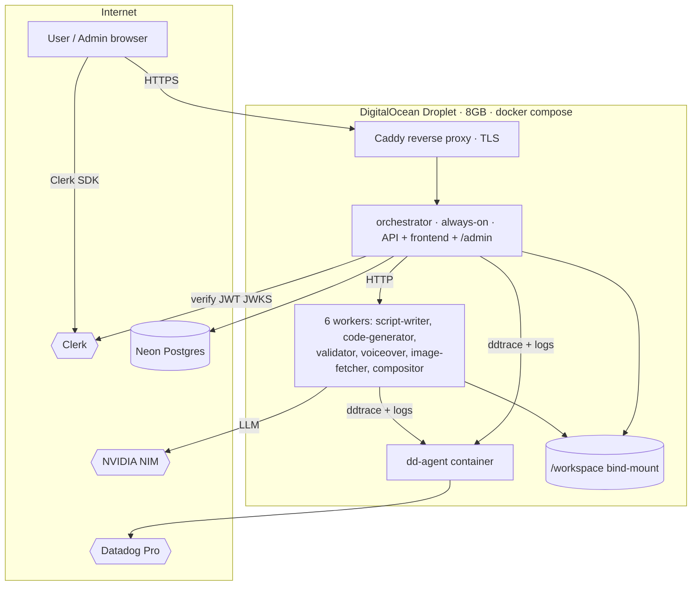
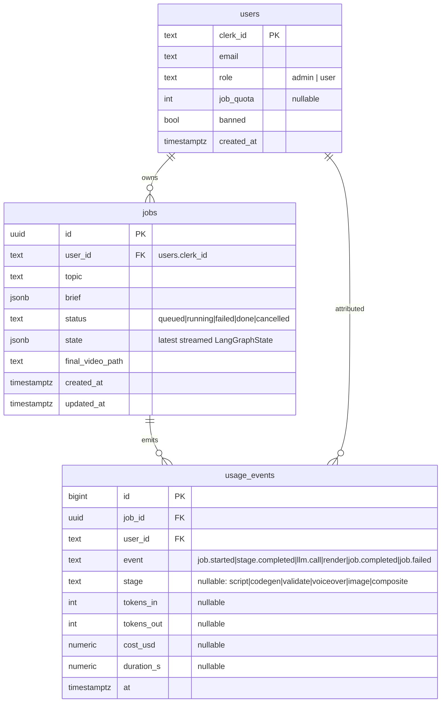

# Deployment & Operations Spec — DigitalOcean + Neon + Clerk + Datadog

**Date:** 2026-06-21
**Status:** Approved design, pre-implementation
**Scope:** Take the existing single-node `docker compose` Manim Agent Network from local-only to a publicly reachable, authenticated, observable deployment — using GitHub Student Pack credits.

---

## 1. Goal

Host the existing 7-service fleet on a cloud the credit budget can sustain for ~5 months, put real authentication in front of the currently-open API, give an operator a dashboard (job ops, analytics, user management, cost watch), and wire full observability (metrics, logs, APM) — **without re-architecting the application**.

## 2. Locked decisions

| Decision | Choice | Rationale |
|---|---|---|
| **Host** | DigitalOcean Droplet (single VM) | $200/yr student credit (largest pot); runs existing `docker-compose.yml` **as-is** — zero re-architecture. Matches the app's actual single-node design. |
| **Droplet size** | 8 GB RAM / 2 vCPU (~$42/mo) | Manim + headless Chromium + Kokoro ONNX + SigLIP ONNX + 7 containers + dd-agent. 4 GB OOMs under concurrent render. ~4.75 months runway on $200. |
| **DB** | Neon Postgres (free tier) | Durable across droplet rebuilds; holds jobs + users + analytics. Replaces ephemeral SQLite. |
| **Auth** | Clerk, 2 roles (`admin`, `user`) | App currently has **no auth**; this closes the public API. Per-user job scoping. |
| **Admin** | Job ops + analytics + user mgmt + cost watch | Single `/admin/*` router inside orchestrator (no separate app). |
| **Observability** | Datadog Pro (student pack, free 2yr) | Metrics + logs + **APM tracing** (Pro unlocks APM). dd-agent as one compose container on the host. |
| **Object storage** | None required (local disk bind-mount) | Single host → shared `/workspace` bind-mount works unchanged. DO Spaces optional, deferred. |

**Rejected alternatives:** Azure Container Apps (heavy re-arch: Blob layer, per-service config, cold-start wiring — only $100 credit); Heroku ($13/mo can't fit 2–4 GB RAM, ephemeral FS, 30s router timeout); Render (paid tiers don't scale to zero → $150+/mo for 6 always-on workers); Railway (no free student credit, cash after $5 trial). Full comparison in the brainstorming thread.

## 3. Constraints

- **No GPU.** Kokoro and SigLIP use `onnxruntime` CPU fallback (already supported). Manim/ffmpeg are CPU.
- **Always-on billing.** No scale-to-zero on a droplet; idle time still costs. Runway is wall-clock, not usage. Accepted.
- **Single node.** No horizontal scale. Matches current architecture (in-process background tasks, one render browser).
- **External LLM.** NVIDIA NIM (`integrate.api.nvidia.com`) reached over the public internet from the droplet — unchanged.

---

## 4. Target architecture

Everything inside the droplet is the **current** `docker-compose.yml`, plus: Caddy (TLS/reverse proxy), the dd-agent container, and an updated orchestrator (auth + `/admin`). The app code changes are confined to the orchestrator and frontend; the 6 worker services are largely untouched.

---

## 5. Hosting — DigitalOcean Droplet

### 5.1 Provisioning
- Ubuntu 22.04 LTS, 8 GB / 2 vCPU, in the region nearest the user.
- Install Docker Engine + Compose plugin.
- SSH key auth only (password login disabled).
- `ufw` firewall: allow 22 (SSH), 80, 443. **Block** the per-service host ports (8001–8006, 8010) from the public internet — only Caddy is exposed.

### 5.2 Reverse proxy & TLS
- **Caddy** container in front of the orchestrator. Automatic Let's Encrypt TLS.
- Domain: a free/owned domain or a DO-assigned record pointed at the droplet's reserved IP.
- Caddy routes `:443 → orchestrator:8000`. Workers are **not** publicly routed (internal Docker network only).
- Reserved (static) IP attached so DNS survives droplet rebuild.

### 5.3 Compose changes
- Add `caddy` and `dd-agent` services to `docker-compose.yml`.
- Remove public `ports:` mappings for the 6 workers and the orchestrator's raw `8010` (keep them on the internal network via `expose:`); publish only Caddy's 80/443.
- `restart: unless-stopped` already set — survives reboot.
- Orchestrator reads `DATABASE_URL` (Neon), Clerk keys, and `DD_*` from environment.

### 5.4 Deploy flow
- GitHub Actions on push to `main`: build images, push to **GitHub Container Registry (ghcr.io)**, SSH to droplet, `docker compose pull && docker compose up -d`.
- Alternatively (phase 1, simpler): build on the droplet (`docker compose up -d --build`) triggered by an SSH deploy step. Registry path is the lazy-but-correct upgrade once builds get slow.
- Secrets stored in GitHub Actions secrets + a root-only `.env` on the droplet (never committed).

### 5.5 Persistence note
- `/workspace` is a bind-mount on the droplet's local disk — fine for scratch + outputs.
- Durable state that must survive a droplet rebuild lives in **Neon** (jobs, users, analytics), **not** the local disk.
- **Optional, deferred:** nightly `rclone`/`s3cmd` push of `workspace/outputs/` to DO Spaces for durable video backup + CDN serving. Not in initial scope.

---

## 6. Database — SQLite → Neon Postgres

### 6.1 Migration
- Current persistence: `services/orchestrator/app/db.py` (SQLite). A `shared/database/` package already exists — confirm its current contents and host the Postgres engine/session factory there.
- Switch to SQLAlchemy + `asyncpg` (or psycopg) against `DATABASE_URL` = Neon **pooled** connection string.
- Introduce **Alembic** for schema migrations (none exists today). Initial migration creates the schema below.
- Neon free tier (0.5 GB, autosuspend) is sufficient for job + analytics rows.

### 6.2 Schema

- `jobs.state` keeps the existing "stream latest state after every node" behavior (now a JSONB column).
- `usage_events` is the single source for analytics tables **and** cost watch. Written from the orchestrator at node boundaries and from LLM-call sites (token counts already returned by NIM).

---

## 7. Authentication — Clerk (admin / user)

### 7.1 Frontend
- Add Clerk JS/React SDK to the SPA (served by the orchestrator). Sign-in/sign-up UI, session token attached to all API calls (`Authorization: Bearer <clerk-jwt>`).

### 7.2 Backend (orchestrator)
- A FastAPI dependency verifies the Clerk JWT against Clerk's **JWKS** (cached), extracts `clerk_id` and `role`.
- On first authenticated request, upsert the user into Neon `users` (mirror role from Clerk `publicMetadata`).
- **Role source of truth:** Clerk `publicMetadata.role`; Neon mirrors it for joins/quotas.

### 7.3 RBAC matrix

| Route | `user` | `admin` | public |
|---|:---:|:---:|:---:|
| `GET /health`, `GET /services/health` | — | — | ✅ |
| `POST /generate` | ✅ (writes `user_id`) | ✅ | ❌ |
| `GET /jobs`, `GET /job/{id}` | ✅ **own only** | ✅ all | ❌ |
| `POST /job/{id}/cancel|resume` | ✅ own | ✅ all | ❌ |
| `GET /video/{id}`, `/scene/{sid}` | ✅ own | ✅ all | ❌ |
| `GET|POST /admin/*` | ❌ | ✅ | ❌ |

- Per-user scoping: every job query filters `WHERE user_id = :clerk_id` unless caller is `admin`.
- This closes today's wide-open API. `POST /generate` without a valid token → 401.

---

## 8. Admin dashboard + analytics

A single `/admin/*` router in the orchestrator + admin-only views in the existing frontend (gated by Clerk `role === 'admin'`). No separate service.

### 8.1 Job ops
- `GET /admin/jobs` — all jobs, filterable by status/user/date; live status, per-scene render state (from `jobs.state`), log tail.
- Actions reuse existing `cancel` / `resume` plus a `retry`.
- Frontend: a live job table (poll `GET /admin/jobs`), drill-in to per-scene state + a log pane, video preview.

### 8.2 Analytics
- `GET /admin/analytics?range=...` returns aggregates computed in Neon from `usage_events`:
  - job volume over time, success/fail rate, avg duration per stage, total + per-day LLM token spend and estimated cost, per-user usage.
- Charts read **Neon aggregates** (SQL `GROUP BY`), not a second time-series store. (Datadog covers real-time/alerting; the dashboard shows exact historical numbers.) **Do not double-build** the same charts in both places.

### 8.3 User management
- `GET /admin/users` — list (Neon, enriched via Clerk API), per-user job counts.
- `POST /admin/users/{clerk_id}/role` — set `admin|user` (writes Clerk `publicMetadata` + Neon mirror).
- `POST /admin/users/{clerk_id}/ban` and `.../quota` — set `banned` / `job_quota`; enforced in `POST /generate`.

### 8.4 Cost watch
- NVIDIA token spend = sum of `usage_events` cost columns (token counts × per-model rate table in config).
- Azure/DO credit burn is **manual/estimated** — a configured `$/day` droplet rate + start date → projected depletion; surfaced as a banner + a Datadog monitor when nearing the budget.
- `GET /admin/cost` returns token spend, estimated infra burn, projected runway.

---

## 9. Observability — Datadog Pro

### 9.1 Agent
- One `datadog/agent` container in compose, `DD_API_KEY` from env, mounted to the Docker socket → auto-discovers and collects metrics/logs from **all** containers on the host (the single-host advantage — trivial setup).
- `DD_APM_ENABLED=true`, `DD_LOGS_ENABLED=true`.

### 9.2 APM tracing
- Add `ddtrace` to each Python service; run under `ddtrace-run`. Unified service tagging: `service` (per service), `env=prod`, `version` (git SHA).
- A single `POST /generate` is traced across orchestrator → script-writer → code-generator → validator → voiceover → image-fetcher → compositor, exposing per-stage latency and retry loops.

### 9.3 Custom metrics (DogStatsD via ddtrace)
- `job.started`, `job.completed`, `job.failed` (counts)
- `render.duration`, `stage.duration{stage}` (timing)
- `llm.tokens{direction,model}`, `llm.cost{model}` (counts/gauges)
- Emitted at the same points that write `usage_events` (one helper, two sinks).

### 9.4 Dashboards & monitors
- **Ops dashboard:** job throughput, success/fail rate, per-stage latency (APM), token spend, host CPU/mem.
- **Monitors:** failure-rate spike, job stuck (running > timeout), host memory pressure (OOM risk on 8 GB), **credit-burn near budget**.

---

## 10. Security

- API closed by Clerk JWT (was fully open). Per-user job isolation enforced in queries.
- Workers not publicly routed (internal Docker network; only Caddy on 80/443).
- Secrets in root-only `.env` + GitHub Actions secrets; never committed. The existing committed `.env` with live keys must be **rotated** before this goes public.
- TLS everywhere (Caddy auto-cert). SSH key-only, `ufw` locked down.
- The existing AST security gate on generated code is retained — it is the trust boundary for LLM-authored code and must not be relaxed.
- Video access: `GET /video/{id}` checks ownership/role before streaming from `/workspace`.

---

## 11. Rollout phases

1. **DB migration** — SQLite → Neon + Alembic; schema (`users`, `jobs`, `usage_events`); app still local. Verify pipeline still runs end-to-end against Neon.
2. **Auth** — Clerk on frontend + JWT verify + RBAC + per-user scoping. Verify 401 on anonymous, user sees only own jobs.
3. **Droplet bring-up** — provision, Caddy + TLS + firewall, deploy compose, run one real job end-to-end in the cloud.
4. **Admin + analytics** — `/admin/*` + frontend views; `usage_events` emission; verify aggregates.
5. **Datadog** — agent container, ddtrace, custom metrics, dashboard, monitors; verify a traced `/generate`.
6. **Hardening** — key rotation, backup decision (Spaces?), monitor tuning.

Each phase is independently verifiable and leaves the system working.

---

## 12. Risks / verify-first

| Risk | Mitigation |
|---|---|
| **8 GB OOM under concurrent render** (Chromium + Manim + 2 ONNX models) | Cap `ORCH_CODEGEN_CONCURRENCY` / `VALIDATOR_MAX_CONCURRENT_RENDERS` low; Datadog memory monitor; resize to 16 GB if needed (halves runway). |
| **Neon autosuspend cold-start** adds latency to first query | Pooled connection string; acceptable for async jobs; keep-warm ping optional. |
| **Credit depletes before 5 months** if droplet oversized | Start at 8 GB/2 vCPU ($42); downsize render concurrency rather than the box. Track burn in cost watch. |
| **Committed live API keys** | Rotate NVIDIA / Clerk / Neon / Datadog keys before public exposure; scrub from git history. |
| **Long renders block the single host** | Existing chunking + per-job timeouts retained; one render browser is a known single-node limit. |

---

## 13. Out of scope (YAGNI)

- Multi-tenant orgs/teams (2 flat roles only).
- Horizontal scaling / multiple droplets / load balancer.
- DO Spaces / CDN (deferred; local disk + optional manual backup).
- Scale-to-zero (not available on a droplet; not worth a cloud switch).
- CI test-gating beyond build+deploy (existing 118-test suite runs locally).

---

## 14. Open questions

- Domain name source (owned vs DO-provided record)? — does not block phases 1–2.
- Default `job_quota` for new `user` accounts (or unlimited)? — default unlimited, admin sets per-user.
